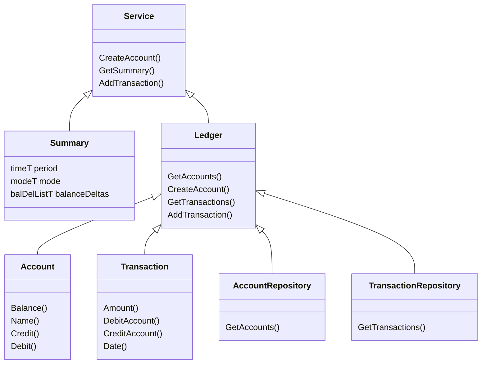

# Architecture

## Summary

The `Simple Accounting` program is for my personal use to track my spending and help keep a budget.  It should be able to do the following:

### Basic Features

1. Track accounts and their balances.
2. Store transactions and associate them with accounts.
3. Summarize spending for a span of time.
   1. A "pay period"
   2. A month
   3. A quarter
   4. A year

### Future Cool Features

1. Create graphs

## Parts and Services

